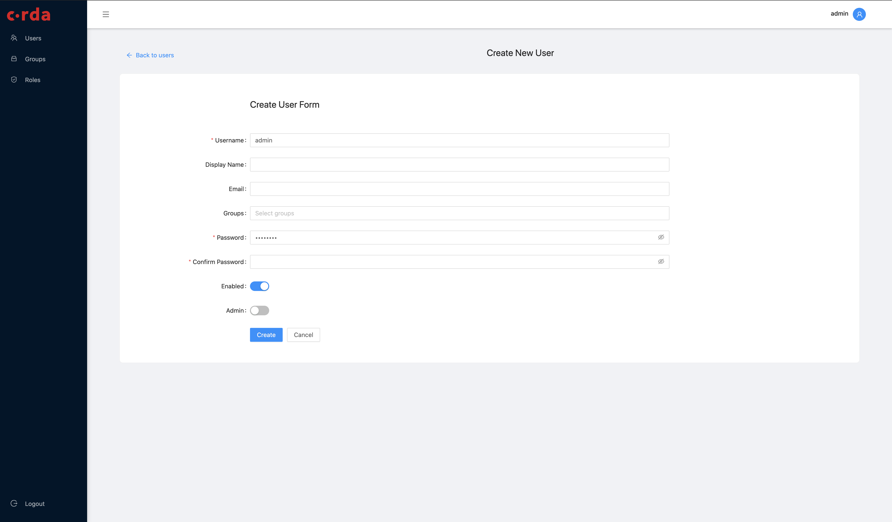

---
aliases:
- /pki-tool.html
- /releases/release-1.2/pki-tool.html
date: '2020-05-22T05:59:25Z'
menu:
  cenm-1-3:
    identifier: cenm-1-3-user-admin-tool
    parent: cenm-1-3-tools-index
    weight: 1015
tags:
- users
-
- tool
title: CENM User Admin tool
---

## CENM User Admin tool

The User Admin tool allows you to manage the profiles of users, groups, and administrators who perform network operations on your bespoke network. You can use the tool to create roles with specific permissions and assign them to users. For example, you can give a user of the Identity Manager service a role that permits them to sign the issuance of a certificate to join the network.

The three main services you can give users access to are:

* Identity Manager service
* Network Map service
* Signing service

With the User Management tool, you can:

* Add users. A user is anyone who requires access to perform network operations.
* Add administrators. An administrator can add and manage users with the tool. For security reasons, an administrator cannot perform any network operations. Only a user can perform this task.
* Manage user and administrator login details.
* Create and manage groups. A group is comprised of multiple users with shared roles and permissions.
* Create and manage roles. A role is a set of permissions that can be assigned to users and groups of users.

### Who can use it

You can only use the User Admin tool if you are registered to use the tool as an Administrator. If you are the first person using the tool in your organisation, you need to request access from your contact at R3.

## Install the CENM User Admin tool

To install the User Admin tool, you first need to request the installation file from your contact at R3. You also need a temporary login to set up your first administrator.

To install Network User Manager:

[STEPS REQUIRED HERE]

## Change your password

When logging into the CENM User Admin tool as an administrator for the first time, you must change your temporary password. You can also repeat this process whenever you want to update your password to access your managed network.

To change your password:

1. Login to the User Management tool. If this is your first use of the tool, or you have requested a new login, use the temporary password you have been given.

2. On the next screen, click on the user profile button in the top right-hand corner.

3. On the **User Details** screen, enter and confirm your new password in the **Change user password** fields.

4. Click **Submit**.

You have changed your password. You are automatically logged out of the User Management tool, and can now log back in using your new password.

## Add a new user or administrator

Users are able to access network services to perform relevant tasks. When you create a user, you can also assign them a role, and add them to a group.

Administrators can only perform tasks on the User Admin tool - an administrator in this tool *cannot* have any role as a user on your network operation services.


You must be registered as an Administrator to create new users and administrators.


To add a new user or administrator:

1. From any screen, click **Users** on the left-hand menu.
    The **Users** screen is displayed. You can see all the users currently managed within the User Admin tool.

2. Click the **Create** icon in the bottom right-hand corner of the screen.

3. On the **Create new user** screen, enter the user's username, display name, and email details in the fields provided.

4. In the **Groups** section, select any groups you wish this user to be added to when their account is activated.

5. In the **Password** field, choose a temporary password that the new user can change on their first use of the User Admin tool.

6. Select **Enabled** for the account to be active immediately. To activate the account later, leave this switched off.

7. To make this user an administrator, set the **Admin** switch to active.

8. Click **Submit**.

You have added a new User.

### Next steps for a new user

The password you give to new users can be changed by them using the CENM CLI. You can give new users these instructions when you add them.

## Manage a user

You can change a user's roles, group membership and active status.

To amend a user's active status, roles and group membership:

1. From any screen, click **Users** on the left-hand menu.
    The **Users** screen is displayed. You can see all the users currently managed within the User Admin tool.

2. Click on the **Username** of the user whose details you wish to amend.

3. On the **User details** screen:

    * Deactivate or reactivate a user with the **Active** switch.
    * Add the member to groups by selecting groups from the **Available groups** box and clicking the **>** chevron move them to the **Existing memberships** box. To remove the user from groups, select and move in the opposite direction.

4. All updates are saved automatically. Click **Back to users** in the top left-hand corner of the screen to return to the list of users.

You have managed a user's groups and active status.

## Create a new Group

You can create Groups to give multiple users common roles and permissions.

To create a Group:

1. From any screen, click **Groups** in the left-hand menu.
    The **Groups** screen is displayed. You can see your existing groups in a card formation.

2. Click the **Create** icon in the bottom right-hand corner of the screen.

3. In the **Create new group** screen, add a name in the **Group name** field.

4. Add an optional description in the **Description** field - this can be used by other administrators to quickly see the purpose of the group.

5. Use the **Users list** dropdown menu to select all the users you wish to be members of this group.

6. Select **Admin** to create a group of administrators for this tool. These users will no longer be able to perform any other CENM tasks outside of this tool.

7. Click **Submit**.

You have created a new group. You can access your newly created group from the **Groups** screen.

## Manage a Group

You can add or remove members of a group, or delete an existing group any time. Deleting a group does not delete the users in the group.

To make changes to a group:

1. From any screen, click **Groups** in the left-hand menu.
    The **Groups** screen is displayed. You can see your existing groups in a card formation.

2. To make changes to a group, click the cog-shaped settings icon.

3. On the **Group details** screen, click on any of the pencil-shaped edit icons to:
    * Edit the name and description of the group.
    * Add new members to the group.
    * Remove members from the group.

4. Changes are saved automatically. When you are finished, click **Back to groups**.

You have made changes to your group. If you have removed a user from the group, they may lose permissions that they had been given as a group-member. You can check an individual user's roles to confirm this.

### To delete a group:

1. From any screen, click **Groups** in the left-hand menu.
    The **Groups** screen is displayed. You can see your existing groups in a card formation.

2. Click the trash icon.

3. In the confirmation dialogue box, click **Yes** to confirm you want to delete the group.

You have deleted a group. The users in the group are still active. Any roles you assigned at group level are no longer applied to the users who were in the group.  

## Create a new Role

Roles are made up of permissions that allow users to perform tasks in CENM. You can create roles by combining the required permissions, and then assigning the role to users and/or groups.

To create a new role:

1. From any screen, click **Roles** in the left-hand menu.
    The **Roles** screen is displayed. You can see the existing roles in a card formation.

2. Click the **Create** icon in the bottom right-hand corner of the screen.
    The **Create new role** screen is displayed.

3. In the **Role name** field, enter the name for this role.

4. In the **Role description** field, enter a free text description with information about what the role allows users to do.

5. In the **Users** field, select the users you wish to assign the role to. If you want to assign the role to multiple users, you might prefer to to create a group and assign the role to the group.

6. In the **Groups** field, select the groups you wish to assign the role to.

    * In the **Add assignments** dialog box, select the group you require from the **Role assignee** list.
    * From the **Assignment scope** list, select the areas to which this role applies.
    * Click **Assign**.

7. In the **Permissions** field, select the permissions granted to a user with this role.

8. Click **Submit**.

You have added a new role. All users and groups assigned this role are granted its permissions with immediate effect.

## Manage a Role

You can assign a role to additional users and groups, remove roles from users and groups, add and remove permissions in a role, and delete roles at any time.

To amend the properties of a role:

1. From any screen, click **Roles** in the left-hand menu.
    The **Roles** screen is displayed. You can see the existing roles in a card formation.

2. Click the menu button in the right corner of the card for the role you wish to amend.

3. On the **Role details** screen, add or remove users, groups, or permissions as required using the **Edit** or **Delete** icons in each field.

4. Click **Submit**.

You have amended the properties of a role. Any changes take effect immediately. If you have removed this role from users or groups, they will no longer have permissions associated with that role. If they are logged into the system, they will be unable to perform tasks enabled by this role.
