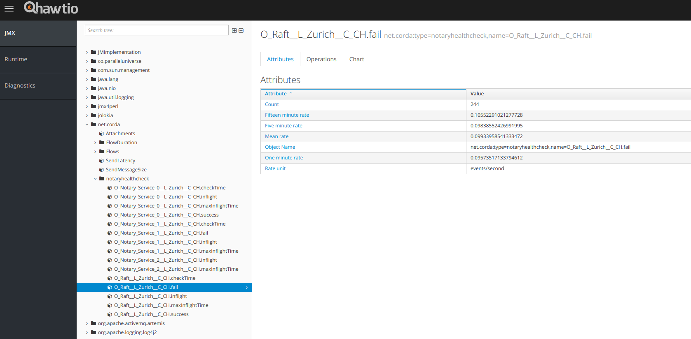

# Notary Health Check

This is a simple CorDapp to check if notaries on a Corda network are up and responsive.


## Installation

To install the app, copy the `notaryhealthcheck-cordapp` and the `notaryhealthcheck-contract` JARs to the `cordapps` directory
of a node that will run the checks. The `notaryhealthcheck-contract` JAR also needs to be installed on all validating
notaries that are to be checked.


## Usage

To set up periodic health checks for a notary service identity or a specific HA notary cluster member, there are two options:


* **Via CorDapp configuration file**: specified targets will be automatically monitored on node startup.
* **Via the CLI client**: commands provided for starting and stopping monitoring specific targets. Note that the health check app operates in-memory only, and checks will not resume after Corda node restart unless specified in the configuration file.


### Configuration file

A standard CorDapp configuration file is used. It must be placed in the `cordapps/config` directory have have the same filename as the CorDapp, apart from the extension.
E.g. for `notaryhealthcheck-cordapp-4.0.jar` the configuration file should be named `notaryhealthcheck-cordapp-4.0.conf`.

```json
# A list of target X500 names to monitor on node startup.
targets = ["O=HA Notary Service, L=Zurich, C=CH"]
# Time between consecutive checks for a single target.
checkIntervalSeconds = 120
# Time to wait for a health check notarisation flow to finish before recording as failure.
checkTimeoutSeconds = 300
```

If a target is a notary service identity, all individual notary cluster members will be monitored as well.


### Command-line client

To simplify controlling the checks, a command line client is provided that will call the respective flows via RPC.
The `notaryhealthcheck-client` is built into a fat JAR and can be executed via Java:

```bash
java -jar notaryhealthcheck-client-<version>.jar -c <command> [<options]
```

The command must be one of:


* **startAll**:
Starts monitoring all notary nodes and services listed in the network parameters (including all cluster members for clustered notaries)


* **start**:
Starts monitoring a specified notary node. Requires use of the `--target` option


* **stopAll**:
Stops all running checks


* **stop**:
Stops monitoring a specified notary node. Requires use of the `--target` option


Options are:


* **-u, –user**:
RPC user to use for the node. This can also be stored in a config file. It must be defined either in config or on the command line.


* **-P, –password**:
RPC password. This can also be stored in a config file. It must be defined either in config or on the command line.


* **-h, –host**:
hostname or IP address of the node.


* **-p, –port**:
RPC port of the node


* **-w, –wait-period**:
Time in seconds to wait between to checks. This can also be stored in a config file. Defaults to 120, i.e. 2 minutes


* **-o, –wait-for-outstanding-flows**:
This is the time we wait before rechecking a notary for which we have a check flow in-flight, i.e. it is not responding timely or at all. This can also be stored in a config file. Defaults to 300, i.e. 5 minutes


* **-t, –target**:
A string representation of the X500 name of the notary node that we want to monitor. Can only be used with `start` or `stop`


* **-n, –notary**:
A string representation of the X500 name of the notary service the target is part of for clustered notaries. This can only be used with `start` or `stop`. It will default to the value of `--target`, so does not need to be specified for single node notaries.


## Monitoring


### Logfile

Every state change of the check (starting a check, successful check,
failed check, check still in-flight when the next is scheduled) will generate a log line with all the relevant stats.
By redirecting the logs for the name `net.corda.notaryhealthcheck.cordapp` to a separate file,
these can be monitored separately from the logging of the rest of the node.

```xml
...
<Appenders>
    ...
    <RollingFile name="HealthCheckFile-Appender"
                 fileName="${log-path}/healthcheck-${log-name}.log"
                 filePattern="${archive}/healthcheck-${log-name}.%date{yyyy-MM-dd}-%i.log.gz">

        <PatternLayout pattern="[%-5level] %date{ISO8601}{UTC}Z [%t] %c{2}.%method - %msg %X%n"/>
            ...
    </RollingFile>
    ...
</Appenders>
<Loggers>
    ...
    <Logger name="net.corda.notaryhealthcheck.cordapp" additivity="false" level="info">
        <AppenderRef ref="HealthCheckFile-Appender" />
    </Logger>
    ...
</Loggers>
```

The log events leave lines like below. There are examples for single node notaries (or notary services), and for
cluster members of a clustered notary, which will list a node name in addition to the notary (service) name.

The first two lines show successful checks, listing the notary (and possibly node) that was checked along with the duration
of how long the notarisation took.

The second set of two lines shows a failed check, showing the notary that was checked, how long the failed notarisation took, and the error message of the failure.

```text
[INFO ] 2019-12-09T16:19:29,394Z [pool-12-thread-13] cordapp.HealthCheckService. - Notary service identity: [O=Raft, L=Zurich, C=CH]: Check successful in 00:00:00.154 {}
[INFO ] 2019-12-09T16:17:29,356Z [pool-12-thread-2] cordapp.HealthCheckService. - Notary service identity: [O=Raft, L=Zurich, C=CH],  Node identity: [O=Notary Service 0, L=Zurich, C=CH]: Check successful in 00:00:00.116 {}

[INFO ] 2019-12-09T14:36:42,774Z [pool-13-thread-2] cordapp.HealthCheckService. - Notary service identity: [O=Raft, L=Zurich, C=CH]: Check failed in 00:00:01.185, Failure: java.util.concurrent.ExecutionException: net.corda.core.flows.NotaryException: Unable to notarise transaction <Unknown> : ...
[INFO ] 2019-12-09T15:05:03,692Z [pool-12-thread-3] cordapp.HealthCheckService. - Notary service identity: [O=Raft, L=Zurich, C=CH],  Node identity: [O=Notary Service 0, L=Zurich, C=CH]: Check failed in 00:00:25.471, Failure: java.util.concurrent.ExecutionException: net.corda.core.flows.NotaryException: Unable to notarise transaction <Unknown> : ...
```


### JMX/Jolokia

The flow also populates a set of JMX metrics in the namespace `net.corda.notaryhealthcheck` that can be used to
monitor notary health via a dashboard or hook up an alerter. As an example, this is the  [hawtio](https://hawt.io)
view on a failing notary check. Note the metrics for *success*, *fail*, *inflight*, and *maxinflightTime* for the
notary service and the cluster members on the left hand side.


