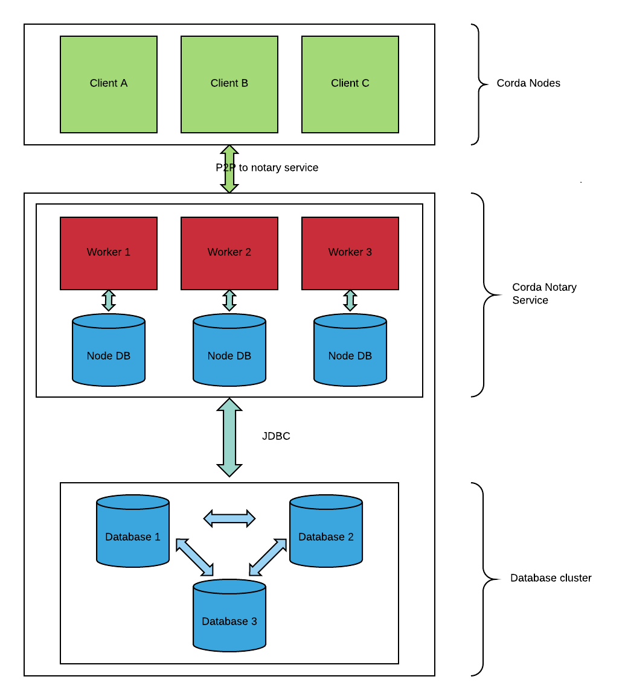
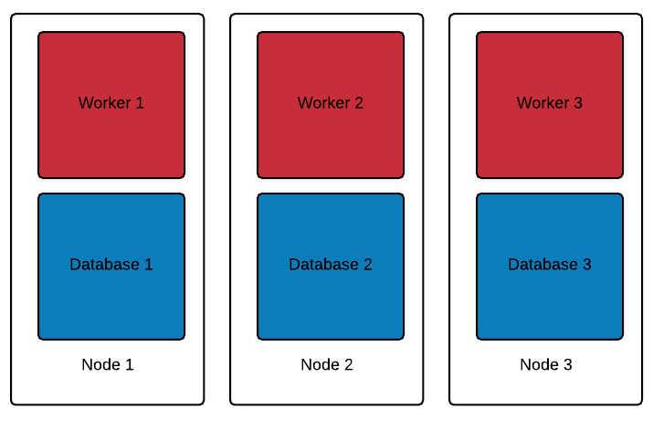

# Corda Enterprise notary service overview

In addition to the single-node notary available in Corda, Corda Enterprise provides two notary implementations that support
high-availability mode:

* MySQL notary (deprecated)
* JPA notary


Because a single-node notary cannot be configured in highly-available mode, and cannot be upgraded to a MySQL or JPA notary, it is
not suited to a production environment. It is strongly recommended to deploy a JPA notary in all non-testing environments.



For a list of databases supported by the MySQL and JPA notaries, please refer to the [Platform support matrix](../platform-support-matrix.md).

## Notary high-availability mode

The JPA and MySQL Corda notary services achieve high-availability (HA) by being are made up of two components:

* The *notary workers*: A set of Corda nodes configured in HA notary mode. Each node has a separate legal identity, but shares a single
notary identity. These nodes are configured to work together in high-availability mode
* The *notary state database*: A single logical database, itself configured to be highly-available, that all the notary workers connect
to


Because each notary worker is a Corda node, in addition to being connected to the notary state database, it requires a standard node
database to store its node state (e.g. its identity information).


We can visualise this set-up as follows, with the regular Corda nodes in green, the Corda notary worker nodes in red, and the standard node
databases and notary state database replicas in blue.

Nodes requesting notarisation from a highly-available notary will connect to the notary workers in round-robin fashion.

Provided there are multiple notary workers and the notary state database is configured to be highly-available, the overall notary service
will be highly-available. This is because the notary service can continue processing notarisation requests even if individual database
replicas and/or notary workers fail. For example, a three-node notary cluster can tolerate one crash fault.


In production you should consider running five nodes or more, in order to be able to tolerate more than one simultaneous crash fault.
Although a single Corda notary worker is enough to serve notarisation requests in practice, its capacity might not be sufficient
depending on your throughput and latency requirements.


If desired, you can choose to run each database server and its Corda notary worker on the same machine:

## Notary configuration

Nodes are configured as single-node notaries or notary workers via their `node.conf` files. For more information, please refer to
../corda-configuration-file.

## Legal names and identities

For a single-node notary, each notary only requires its own legal name, specified in the node’s configuration file.

The MySQL and JPA notary implementation require every notary worker node to be configured with two legal names:

* The worker’s legal name, specified in the node’s configuration file as `myLegalName` (e.g `O=Worker 1, C=GB, L=London`). This is
worker-specific
* The notary legal name, specified in the node’s configuration file by `notary.serviceLegalName` (e.g. `O=HA Notary,C=GB, L=London`).
This is shared by all workers in the notary cluster

Only the notary legal name and public key are included in the network parameters.

## Keys and certificates

As described above, every notary worker is configured with both its own legal name and the shared service legal name. These names
correspond to identities that have their own key pair and certificate, which should be accessible by the notary worker.

Both worker identity and notary service keys and certificates are stored in the same way as for regular Corda nodes. That is, if using local
key stores, the worker identity, worker node CA and notary service key pairs and certificates are stored in files within the
`certificates` directory. If an HSM is being used to generate and store the keys then only the certificate chains will be stored in the
local files. You can find out more in the ../permissioning document.


The key store aliases for the worker identity, worker node CA and notary service are fully configurable. Unique worker identity and node
CA aliases are required for the workers to share the same HA HSM. Although not required for all deployment scenarios, it is recommended
to configure unique worker aliases. See ../corda-configuration-file for more information.



## Expected data volume

Non-validating notaries store roughly one kilobyte per transaction.

